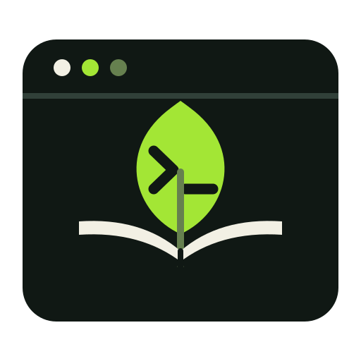

# TermLeaf

<p align="center">
  
</p>

Turn pages without leaving the terminal.

**Last updated:** August 23, 2026

## Table of Contents

- [What Is TermLeaf?](#what-is-termleaf)
- [First Release](#first-release)
- [Where Things Stand](#where-things-stand)
- [Technical Direction](#technical-direction)
- [Development](#development)
- [License](#license)
- [Project Notes](#project-notes)

## What Is TermLeaf?

TermLeaf is a reader for people who are happiest at the command line. Open a
book, settle into a clean reading view, and pick up where you stopped last
time. No browser tab, mouse hunt, or account should get in the way.

## First Release

TermLeaf will open local TXT, Markdown, and reflowable EPUB books. The reader
will include:

- Paged and continuous reading modes.
- Semantic text and best-effort terminal images.
- Conventional and Vim-style navigation keys.
- Smart-case search and detailed reading progress.
- Saved positions, bookmarks, highlights, and notes.
- A recent-books screen without automatic directory scanning.
- Dark, light, high-contrast, monochrome, and Paper themes.
- Confirmed external links and in-application help.
- Native Linux, macOS, and Windows releases after platform tests pass.

Images will use a supported terminal graphics protocol when one is positively
detected, fall back to a cell-based preview, and finally show a useful caption.
Books and annotations remain local, and TermLeaf never rewrites the source book.

## Where Things Stand

Phase 0 and Phase 1 are complete. Phase 2's local implementation now includes
bounded Markdown and EPUB semantics, exact internal navigation, archive and XML
security gates, static raster/SVG decoding, bounded generation-aware workers,
terminal image capability selection, a Kitty/Sixel/iTerm2 transport foundation,
bounded one-shot capability probing, PTY image lifecycle journeys, half-block
and caption fallbacks, and a responsive table of contents. Hosted environment
journeys and native protocol acceptance evidence are tracked separately and are
not claimed before they run. The plan
now treats coverage-guided fuzzing as optional
scheduled discovery rather than mandatory duration-based gate work, and the
executable registry and gate manifests enforce that policy.

## Technical Direction

TermLeaf will use stable Rust with Ratatui and Crossterm. Plain text comes first,
followed by Markdown and bounded EPUB parsing. The reader owns logical document
positions and Unicode-aware layout so resizing does not lose the current
passage. The [project plan](project_plan.md) records the complete architecture,
security limits, delivery gates, and primary references.

## Development

The package requires Rust 1.88 or newer. Run the core local checks with:

```text
python3 tools/case_registry.py check
cargo fmt --check
cargo clippy --all-targets --all-features --locked -- -D warnings
cargo test --locked
cargo test --doc --locked
cargo deny check
```

## License

Copyright (C) 2026 Aman Ali. TermLeaf is licensed under
`GPL-3.0-only`; see [LICENSE](LICENSE) for the full terms.

## Project Notes

- [Project plan](project_plan.md): where TermLeaf is going and how we will get
  there.
- [Implementation tracker](implementation_tracker.md): what is built, what is
  next, and what is holding us up.
- [Commit tracker](commit_tracker.md): what changed and the reasoning behind
  decisions that will matter later.
- [Test report](testreport.md): the checks, fixtures, environment, and outcomes
  recorded for every commit.
- [Rust code quality standards](code_quality.md): the engineering rules every
  implementation change must satisfy.
- [Test case framework](testcases.md): stable cases, execution profiles,
  fixtures, environments, and phase gates for proving those rules.
- [UI mockups](ui_mockups.md): responsive ASCII screens, focus and overlay
  behavior, accessibility intent, implementation guidance, and phase ownership.
